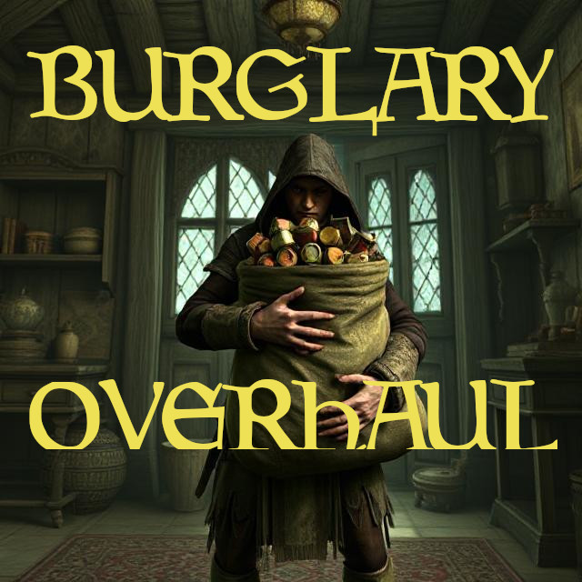

# ErnBurglary
OpenMW mod that overhauls theft. No longer will NPCs forget that you were in their house when all their gems were stolen.

## Witnesses and Punishment
If an NPC greets you, they will remember that you are in the area. If their stuff disappeared before you left, you'll be caught *after-the-fact*. This punishment is less severe than *red-handed* theft: the value of the stolen goods will be subtracted from the owner's disposition until it hits 0. Any leftover value will be converted into bounty.

Stolen items that belong to a faction will get reported if any member of that faction remembers you in the area. You can optionally reduce your faction reputation, and have the excess converted into bounty and explusion (if you are a member).

Guards look out for everyone's items, not just their own.

If witnesses are dead before you leave the area, they won't report the theft.

## Red-handed Theft
The punishment for red-handed theft is reduced to a token 1 gp in order to avoid double-jeopardy. Getting caught red-handed will immediately resolve any pending thefts you did earlier.

## Re-implementation of No Witness No Bounty
You can optionally enable behavior that mimics what you see in *No Witness No Bounty*. If there are no witnesses by the time you leave the area, all bounties will reset to what they were when you entered. I had to re-implement this because getting them to work together would be harder.

## Trespassing
When you enter an area through a door that was locked with a key, but you don't have that key, you'll be considered trespassing. If the door is owned by someone, it's also considered trespassing to use it.
If you get Spotted while trespassing, you'll incur a 10 gold fine (configurable).
So long as you've used the key on the door once, you will be allowed in the area through that door from then on. You don't have to keep the key forever.

## Indicators
While you're spotted in the area, a 5pt Drain Sneak effect is applied. This is removed as soon as you're no longer spotted.

You can configure a Spotted icon that will appear in your HUD while you are Spotted and sneaking.

These alerts will show up (they can all be disabled except the last one):
- If you enter an area and are trespassing, you'll get an alert.
- When you enter sneak mode, you'll get an alert if you were previously spotted.
- If you're spotted while in sneak mode, you'll also get an alert.
- If all the witnesses die, you'll get another alert.
- If you get caught when you leave, you'll get an alert.

## How it Works
If you're near an NPC and they say something, the mod checks if you are sneaking. If you are sneaking, the mod reproduces the same vanilla game logic for sneak detection. If you fail that check, then the NPC is marked as having spotted you. If you're super close to the NPC, they don't have to say anything.

Every item you pick up is also tracked, unless you picked it up during a dialogue or barter screen.

When you leave the cell, the items you picked up are matched with their owners, punishment is determined, and your Spotted flag is cleared.

## Compatibility

### Yes
- Harder Better Faster Stronger.

### Maybe
- Pause Control - as of v0.6.0
- Shop Around - as of v0.6.0
- Devilish Sleep Spell (OpenMW 0.49)

### No
- Regionally Known Criminals
- No Witness No Bounty



## Installing
Extract [main](https://github.com/erinpentecost/ErnBurglary/archive/refs/heads/main.zip) to your `mods/` folder.


In your `openmw.cfg` file, and add these lines in the correct spots:

```yaml
data="/wherevermymodsare/mods/ErnBurglary-main"
content=ErnBurglary.omwaddon
content=ErnBurglary.omwscripts
```

## Integrations

See the `interface.lua` file if you'd like to hook into spotted and theft events, or if you want to ensure compatibility with unpause mods. 


## Contributing

Feel free to submit a PR to the [repo](https://github.com/erinpentecost/ErnBurglary) provided you certify your contribution under the [Developer Certificate of Origin](https://developercertificate.org/).

### omwaddon
The omwaddon contains these entries:
* `fCrimeStealing` penalty set to 0.
* `ernburglary_spotted` spell that contains the penalty for being spotted.
